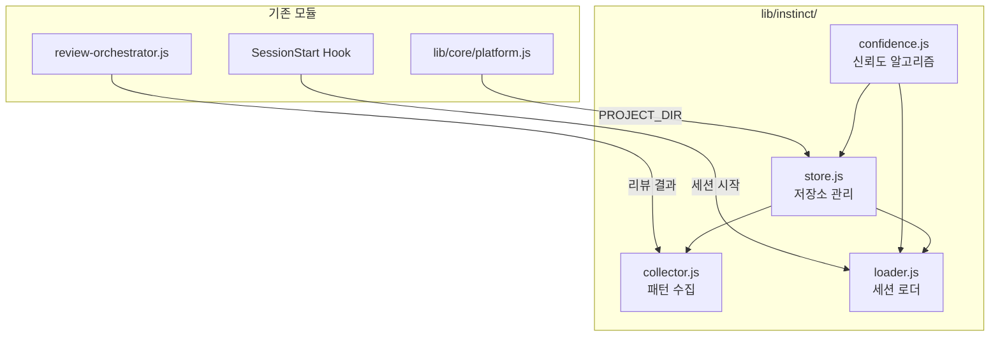

# instinct-engine Design Document

> **Summary**: 인스팅트 학습 엔진 상세 설계 — 4개 모듈, JSON 스키마, 수렴 알고리즘
>
> **Project**: rkit
> **Version**: v0.9.13
> **Author**: 노수장
> **Date**: 2026-04-10
> **Status**: Draft
> **Planning Doc**: `docs/01-plan/features/instinct-engine.plan.md`
> **Prior Design**: `docs/archive/2026-04/ecc-insights-integration/ecc-insights-integration.design.md` Section 7

---

## 1. Overview

### 1.1 설계 목표

L1/L2 코드 리뷰 결과와 사용자 교정을 세션 간 자동 누적하는 인스팅트 학습 엔진을 구현한다. 4개 모듈(confidence, store, collector, loader)이 협력하여 패턴 수집 → 저장 → 신뢰도 계산 → 세션 로드 파이프라인을 구성한다.

### 1.2 설계 원칙

| 원칙 | 설명 |
|------|------|
| **Graceful Degradation** | 인스팅트 비활성화/파일 손상 시 기존 동작에 영향 없음 |
| **확장 가능 데이터 구조** | `scope`, `origin` 필드로 v0.9.14 크로스 프로젝트/팀 공유 대비 |
| **토큰 절약** | 수렴된 패턴만 프롬프트에 주입, 컴팩트 텍스트 변환 |
| **파일 기반 저장** | DB 없이 `.rkit/instinct/{project-hash}/` JSON 파일 |

---

## 2. Architecture

### 2.1 모듈 의존성



### 2.2 데이터 흐름

```
1. /code-review 실행
   │
2. review-orchestrator.js → L1/L2 리뷰 결과
   │
3. collector.js
   ├── extractPatterns(reviewResult) → 패턴 배열
   └── store.js에 저장
       ├── patterns.json 업데이트
       └── confidence.js로 신뢰도 계산 → confidence.json 업데이트
   │
4. 다음 세션 시작
   │
5. loader.js (SessionStart 훅)
   ├── store.js에서 패턴 로드
   ├── confidence >= converged 필터링
   └── 컴팩트 텍스트로 세션에 주입
```

### 2.3 디렉토리 구조

```
.rkit/instinct/
├── {project-hash}/           # 프로젝트별 저장소 (12자 hex)
│   ├── patterns.json         # 학습된 패턴
│   └── confidence.json       # 신뢰도 점수
└── global/                   # Phase 4 확장점 (v0.9.14)
    ├── patterns.json
    └── confidence.json
```

---

## 3. Module Design: confidence.js

### 3.1 상수

```javascript
const INITIAL_CONFIDENCE = 0.3;
const APPLY_FACTOR = 0.2;
const REJECT_FACTOR = 0.3;
const DECAY_FACTOR = 0.05;
const CONVERGENCE_THRESHOLD = 0.05;
const CONVERGENCE_SESSIONS = 3;
const DEACTIVATION_THRESHOLD = 0.1;
```

### 3.2 인터페이스

```javascript
module.exports = {
  INITIAL_CONFIDENCE,
  APPLY_FACTOR,
  REJECT_FACTOR,
  DECAY_FACTOR,
  CONVERGENCE_THRESHOLD,
  CONVERGENCE_SESSIONS,
  DEACTIVATION_THRESHOLD,

  /**
   * 신뢰도 업데이트
   * @param {number} current - 현재 신뢰도 (0-1)
   * @param {'applied'|'rejected'|'decay'} action
   * @returns {{ score: number, delta: number }}
   */
  updateConfidence(current, action) { },

  /**
   * 수렴 판정 — 최근 N세션에서 delta가 모두 threshold 미만
   * @param {Array<{ delta: number }>} history - 최근 세션 이력
   * @returns {boolean}
   */
  isConverged(history) { },

  /**
   * 패턴 비활성화 판정
   * @param {number} confidence
   * @returns {boolean}
   */
  isDeactivated(confidence) { },

  /**
   * 글로벌 승격 후보 판별 (v0.9.14 확장점)
   * @param {number} confidence
   * @param {number} projectCount
   * @returns {boolean}
   */
  isPromotable(confidence, projectCount) { },
};
```

### 3.3 수렴 알고리즘

```
세션마다:
  applied:  confidence += APPLY_FACTOR × (1 - confidence)
  rejected: confidence -= REJECT_FACTOR × confidence
  decay:    confidence -= DECAY_FACTOR × confidence

수렴: CONVERGENCE_SESSIONS 연속 |delta| < CONVERGENCE_THRESHOLD
비활성화: confidence < DEACTIVATION_THRESHOLD
승격 (v0.9.14): confidence >= 0.8 AND projectCount >= 3
```

**수렴 시각화**:

```
Session 1: 0.30          (초기)
Session 2: 0.44 (+0.14)  applied
Session 3: 0.55 (+0.11)  applied
Session 4: 0.64 (+0.09)  applied
Session 5: 0.71 (+0.07)  applied
Session 6: 0.77 (+0.06)  applied
Session 7: 0.81 (+0.04)  ← 수렴 시작
Session 8: 0.85 (+0.04)  ← 수렴 2회
Session 9: 0.88 (+0.03)  ← 수렴 3회 → converged!
```

---

## 4. Module Design: store.js

### 4.1 프로젝트 식별

```javascript
/**
 * 프로젝트 해시 생성 (12자 hex)
 * 1차: git remote URL 기반
 * 2차: 디렉토리 경로 해시 (fallback)
 */
function getProjectHash() {
  try {
    const remote = execSync('git remote get-url origin', { encoding: 'utf8' }).trim();
    return crypto.createHash('sha256').update(remote).digest('hex').slice(0, 12);
  } catch {
    const projectDir = getPlatform().PROJECT_DIR;
    return crypto.createHash('sha256').update(projectDir).digest('hex').slice(0, 12);
  }
}
```

### 4.2 인터페이스

```javascript
module.exports = {
  getProjectHash,

  /**
   * 패턴 로드 (없으면 빈 구조 반환)
   * @param {string} [projectHash] - 생략 시 자동 계산
   * @returns {{ version, projectId, projectMeta, patterns, metadata }}
   */
  loadPatterns(projectHash) { },

  /**
   * 패턴 저장 (원자적 쓰기: tmp → rename)
   * @param {string} projectHash
   * @param {Object} data
   */
  savePatterns(projectHash, data) { },

  /**
   * 신뢰도 데이터 로드
   * @param {string} [projectHash]
   * @returns {{ version, projectId, scores, globalCandidates }}
   */
  loadConfidence(projectHash) { },

  /**
   * 신뢰도 데이터 저장
   * @param {string} projectHash
   * @param {Object} data
   */
  saveConfidence(projectHash, data) { },

  // v0.9.14 확장점
  loadGlobalPatterns() { },
  promoteToGlobal(patternId, projectHash) { },
};
```

### 4.3 파일 경로

```javascript
const INSTINCT_BASE = path.join(getPlatform().PROJECT_DIR, '.rkit', 'instinct');
// 프로젝트별: .rkit/instinct/{hash}/patterns.json
// 프로젝트별: .rkit/instinct/{hash}/confidence.json
// 글로벌:     .rkit/instinct/global/patterns.json  (v0.9.14)
```

### 4.4 원자적 쓰기

```javascript
function atomicWrite(filePath, data) {
  const tmp = filePath + '.tmp';
  fs.writeFileSync(tmp, JSON.stringify(data, null, 2));
  fs.renameSync(tmp, filePath);
}
```

### 4.5 빈 구조 초기화

```javascript
function createEmptyPatterns(projectHash) {
  return {
    version: '1.0.0',
    projectId: projectHash,
    projectMeta: { remoteUrl: '', domain: 'unknown', languages: [] },
    patterns: [],
    metadata: { totalSessions: 0, lastUpdated: new Date().toISOString(), schemaVersion: '1.0.0' },
  };
}

function createEmptyConfidence(projectHash) {
  return {
    version: '1.0.0',
    projectId: projectHash,
    scores: {},
    globalCandidates: [],
  };
}
```

---

## 5. Module Design: collector.js

### 5.1 인터페이스

```javascript
module.exports = {
  /**
   * L1/L2 리뷰 결과에서 패턴 추출
   * @param {Object} reviewResult - review-orchestrator.js의 ReviewResult
   * @param {string} sessionId - 현재 세션 ID
   * @returns {Object[]} 추출된 패턴 배열 (patterns.json 스키마 준수)
   */
  extractPatterns(reviewResult, sessionId) { },

  /**
   * 사용자 교정 이벤트에서 패턴 추출
   * @param {{ before: string, after: string, filePath: string }} correctionEvent
   * @param {string} sessionId
   * @returns {Object|null}
   */
  extractCorrectionPattern(correctionEvent, sessionId) { },

  /**
   * 추출된 패턴을 store에 저장 + confidence 업데이트
   * @param {Object[]} patterns
   * @param {string} sessionId
   */
  saveExtractedPatterns(patterns, sessionId) { },
};
```

### 5.2 패턴 추출 로직

```
ReviewResult.findings에서:
1. 각 finding의 (rule, file, severity)를 분석
2. 기존 patterns.json에서 유사 패턴 검색 (category + language 매칭)
3. 유사 패턴 발견 → sessions 배열에 { sessionId, action: "detected" } 추가
4. 신규 패턴 → UUID v4 생성, confidence = INITIAL_CONFIDENCE, scope = "project"
```

### 5.3 중복 감지

```javascript
function findSimilarPattern(existing, newPattern) {
  return existing.find(p =>
    p.category === newPattern.category &&
    p.pattern.language === newPattern.pattern.language &&
    p.pattern.description === newPattern.pattern.description
  );
}
```

---

## 6. Module Design: loader.js

### 6.1 인터페이스

```javascript
module.exports = {
  /**
   * 수렴된 패턴 로드 → 프롬프트 주입 텍스트 생성
   * @returns {string} 프롬프트에 주입할 컴팩트 텍스트 (빈 문자열이면 패턴 없음)
   */
  loadConvergedPatterns() { },

  /**
   * 인스팅트 프로파일 요약
   * @returns {{ totalPatterns: number, converged: number, active: number, deactivated: number, lastUpdated: string }}
   */
  getProfileSummary() { },
};
```

### 6.2 컴팩트 텍스트 변환

수렴된 패턴을 토큰 효율적인 텍스트로 변환:

```
## Project Instinct (auto-learned patterns)
- [naming] Use snake_case for C functions (confidence: 0.88)
- [idiom] Prefer unique_ptr over raw new (confidence: 0.92)
- [convention] Add #nullable enable to all C# files (confidence: 0.85)
```

**제한**: 최대 20개 패턴, 총 500 토큰 이내.

### 6.3 SessionStart 훅 연동

```javascript
// scripts/session-start.js에서 호출
const { loadConvergedPatterns, getProfileSummary } = require('../lib/instinct/loader');

const instinctText = loadConvergedPatterns();
if (instinctText) {
  // 세션 컨텍스트에 주입
  additionalContext += '\n' + instinctText;
  const summary = getProfileSummary();
  additionalContext += `\n(Instinct: ${summary.converged} converged / ${summary.totalPatterns} total)`;
}
```

---

## 7. Data Schema

### 7.1 patterns.json

ecc-insights-integration Design Section 7.3 확정 스키마를 그대로 사용한다.

핵심 필드:
- `patterns[].id`: UUID v4
- `patterns[].category`: naming | structure | idiom | security | convention | architecture
- `patterns[].confidence`: 0-1
- `patterns[].scope`: project | global | team (v0.9.14 확장점)
- `patterns[].origin.source`: review | correction | manual | promoted
- `patterns[].sessions[]`: 관찰/적용 이력

### 7.2 confidence.json

ecc-insights-integration Design Section 7.4 확정 스키마를 그대로 사용한다.

핵심 필드:
- `scores[patternId].current`: 현재 신뢰도
- `scores[patternId].history[]`: 세션별 변화 이력
- `scores[patternId].convergedAt`: 수렴 세션 번호 (null이면 미수렴)
- `scores[patternId].promotable`: 글로벌 승격 후보 (v0.9.14)

---

## 8. Error Handling

| 상황 | 처리 |
|------|------|
| `.rkit/instinct/` 디렉토리 없음 | 자동 생성 (`mkdirSync recursive`) |
| patterns.json 파싱 실패 | 경고 로그, 빈 구조로 초기화 (기존 파일 `.bak`으로 백업) |
| confidence.json 파싱 실패 | 경고 로그, 빈 구조로 초기화 |
| git remote 없음 | 디렉토리 경로 해시 fallback |
| patterns.json > 500KB | 가장 오래된 비활성 패턴부터 제거 |
| 원자적 쓰기 실패 | `.tmp` 파일 제거, 에러 로그 (기존 파일 보존) |

---

## 9. Test Plan

### 9.1 Unit Test: confidence.js

| 테스트 | 입력 | 기대 결과 |
|--------|------|-----------|
| applied 업데이트 | current=0.3, applied | score=0.44, delta=0.14 |
| rejected 업데이트 | current=0.8, rejected | score=0.56, delta=-0.24 |
| decay 업데이트 | current=0.5, decay | score=0.475, delta=-0.025 |
| 수렴 판정 | 3 deltas=[0.04, 0.04, 0.03] | true |
| 미수렴 판정 | 3 deltas=[0.04, 0.06, 0.03] | false |
| 비활성화 | confidence=0.08 | true |
| 승격 후보 | confidence=0.85, projects=3 | true |

### 9.2 Integration Test: store.js

- loadPatterns: 파일 없음 → 빈 구조 반환
- savePatterns → loadPatterns: round-trip 일치
- atomicWrite: tmp 파일 생성 확인, rename 성공
- getProjectHash: git remote vs fallback 모두 12자 hex

### 9.3 Integration Test: collector + store

- extractPatterns: ReviewResult → 패턴 배열 생성
- 중복 감지: 동일 패턴 → sessions에 append
- saveExtractedPatterns → loadPatterns: 저장 확인

### 9.4 E2E Test: loader

- 수렴 패턴 있을 때 → 컴팩트 텍스트 반환
- 수렴 패턴 없을 때 → 빈 문자열
- getProfileSummary: 카운트 정확성

---

## 10. Implementation Order

| 순서 | 파일 | 선행 조건 | 검증 |
|------|------|----------|------|
| 1 | `lib/instinct/confidence.js` | 없음 | 수렴 시각화 예시와 동일한 결과 |
| 2 | `lib/instinct/store.js` | 1 | loadPatterns/savePatterns round-trip |
| 3 | `lib/instinct/collector.js` | 2 | ReviewResult에서 패턴 추출 + 저장 |
| 4 | `lib/instinct/loader.js` | 2, 1 | 수렴 패턴 필터링 + 컴팩트 텍스트 |
| 5 | 통합: review-orchestrator 연동 | 3 | /code-review 후 자동 수집 |

---

## 11. Version History

| Version | Date | Changes | Author |
|---------|------|---------|--------|
| 0.1 | 2026-04-10 | ecc-insights-integration Design Section 7 기반 standalone 작성. 4개 모듈 인터페이스, 에러 처리, 테스트 플랜, 구현 순서 추가 | 노수장 |
