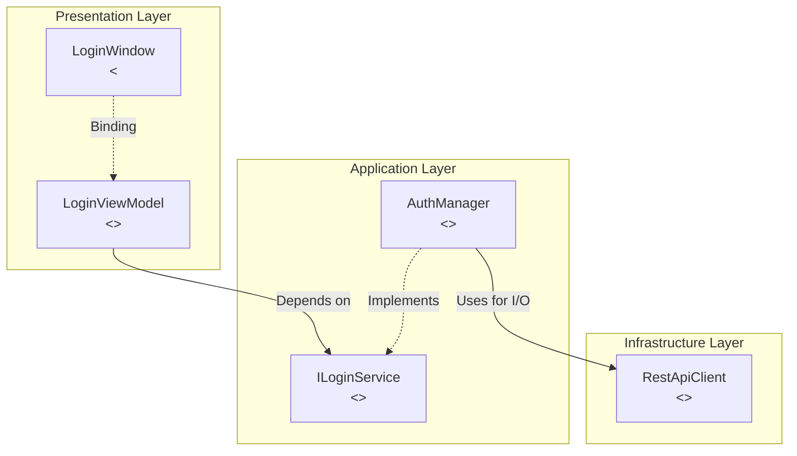
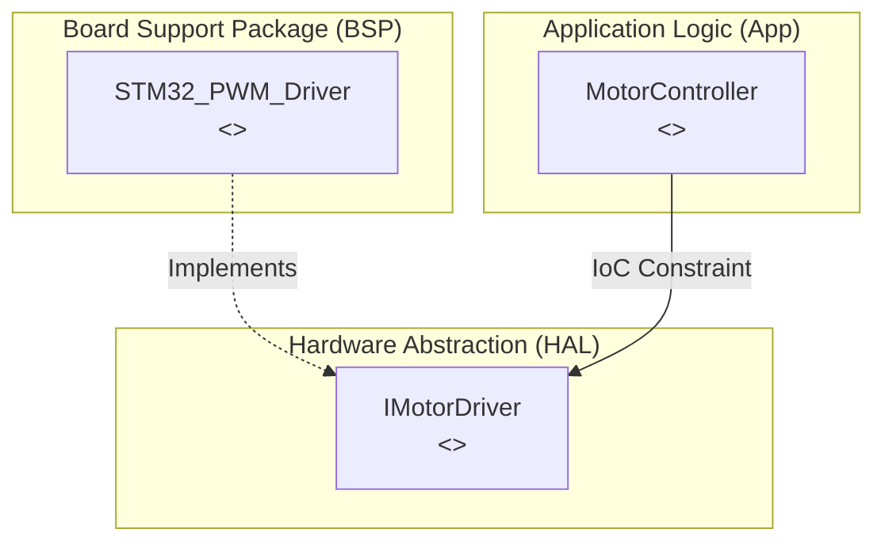

# Architecture Patterns & Compliance Standard (M11)

This document is the **Gold Standard** for evaluating and generating System Architectures in the `rkit` PDCA workflow. All Mermaid diagrams and structural implementations MUST strictly adhere to these heuristics to pass the **M11: Architecture Compliance** quality gate.

---

## 1. M11: The 5-Point Heuristic Evaluation

When the `gap-detector` evaluates the `Design Phase` architecture, it grades out of 100 points. Failure to meet at least 90 points results in an immediate rejection of the phase transition.

| Heuristic | Criteria for 20 Points |
|-----------|-------------------------|
| **1. Isolation (Cohesion vs Coupling)** | Core Domain / Business Logic is 100% agnostic to external inputs. It does not import UI files, Database drivers, or raw Network HTTP clients. |
| **2. Dependency Inversion (IoC)** | High-level orchestration layers interact with specific drivers/databases via `<<Interface>>` or abstractions, never by direct concrete instantiation. |
| **3. Zero Circular Dependency** | The Mermaid diagram reveals no back-and-forth loops (A $\to$ B and B $\to$ A). All boundaries point inwards toward domain logic. |
| **4. DRY & Structural Reuse** | The developer properly reused existing files/modules provided in the `architecture-map`. No "reinventing the wheel" for basic parsers or state mechanisms. |
| **5. Subgraph & GoF Stereotyping** | The visual schema strictly follows `subgraph` grouping (Layering) and `<<Stereotype>>` tagging (Role Definition), proving Single Responsibility. |

---

## 2. Mandatory Diagram Framing (Mermaid)

When outputting a Mermaid diagram, you MUST use `subgraph` to encapsulate structural bounds. Do not output a flat diagram.

### Example: Clean Layered Architecture (WPF / Web)

### Example: Firmware / MCU Architecture (Low-Level)

---

## 3. Allowed GoF / Structural Stereotypes

Every box (class or module) in your architecture MUST have one of the following stereotypes (`<<Name>>`) assigned to its label to mathematically prove its Single Responsibility Component (SRC):

* **Creational**: `<<Factory>>`, `<<Builder>>`, `<<Singleton>>`
* **Structural**: `<<Adapter>>`, `<<Facade>>`, `<<Decorator>>`, `<<Proxy>>`
* **Behavioral**: `<<Observer>>`, `<<Mediator>>`, `<<Strategy>>`, `<<State>>`
* **Domain Driven**: `<<Repository>>`, `<<Entity>>`, `<<ValueObject>>`, `<<AggregateRoot>>`
* **MVC / MVVM**: `<<View>>`, `<<ViewModel>>`, `<<Controller>>`, `<<Service>>`

If a module doesn't fit any of these, it is likely doing too much (Violates Single Responsibility) or too little. Reflexively analyze and redesign it.
